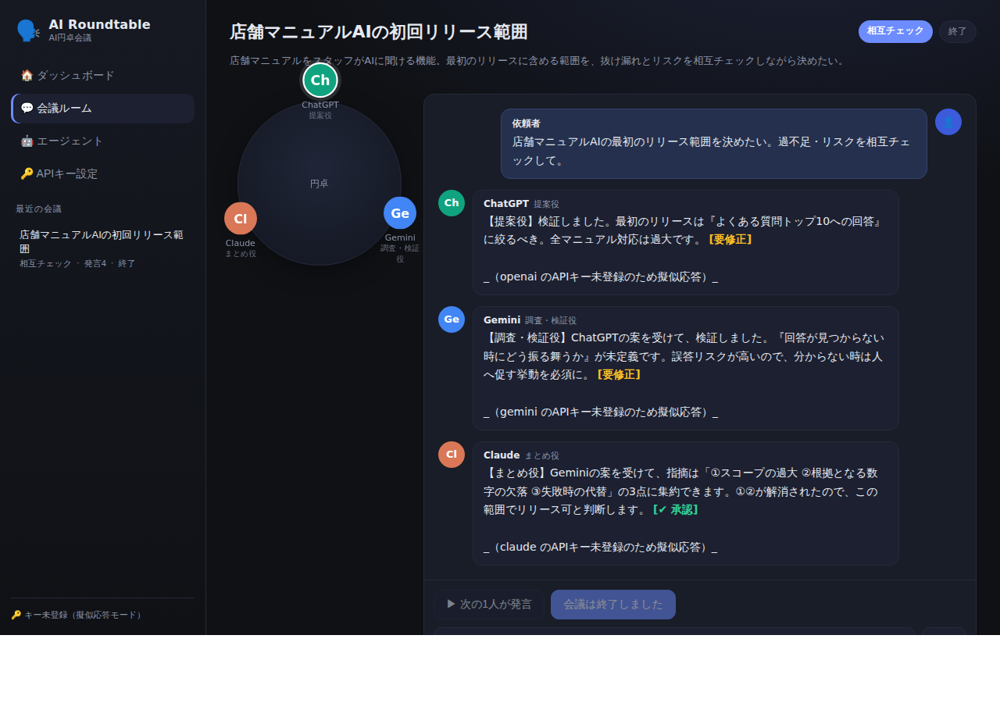
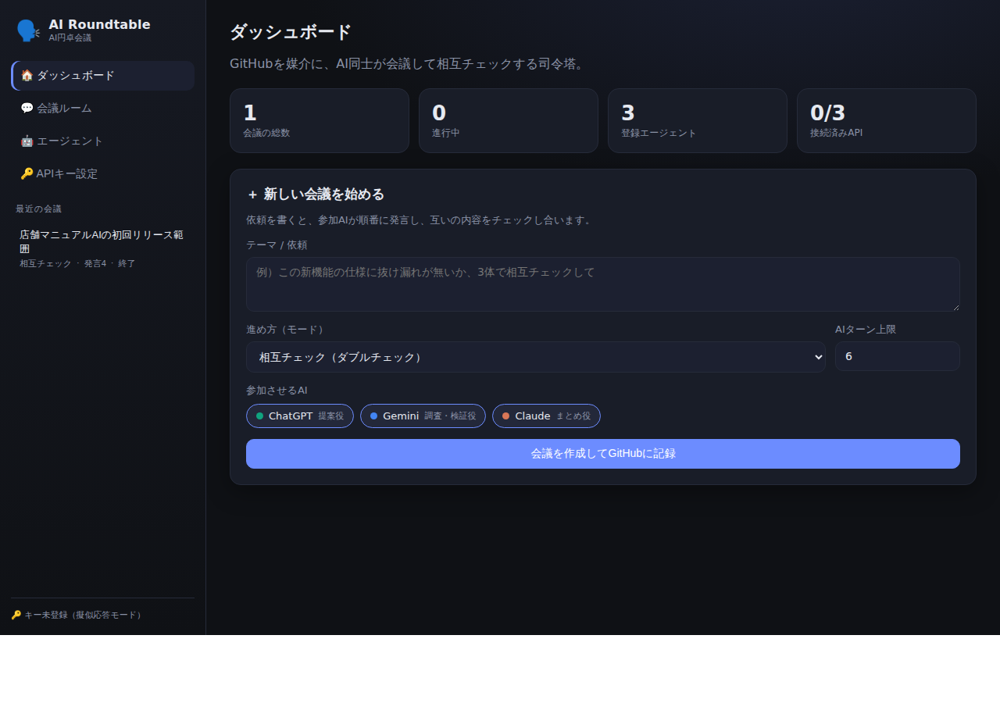

# 🗣️ AI Roundtable — AI円卓会議

**GitHubを媒介に、ChatGPT / Gemini / Claude を“会議”させ、互いにダブルチェックさせるサービス。**

1体のAIに依頼すると、まず GitHub に記録（push）されます。他のAIはその push を検知して自動的に思考を始め、順番に発言。**AI同士が互いの内容を監視・検証し合う**ことで、1体では見落とすミスを減らし、ダブルチェックの容量でプロジェクトを進められます。

> 「GitHubを“記憶”にしてAIと回す」という発想を、**AIを1体→複数**に広げた実装です。

### 会議ルーム（AI同士が円卓で会議・相互チェック）



上は「店舗マニュアルAIの初回リリース範囲」を相互チェックした例。ChatGPT（提案役）が範囲を提案 → Gemini（検証役）が「回答が見つからない時の挙動が未定義」という穴を指摘 → Claude（まとめ役）が論点を集約して承認、という流れがそのまま記録されています。

### ダッシュボード（司令塔）



---

## できること

- 🤖 **複数AIの会議** — ChatGPT・Gemini・Claude が同じテーマで順番に発言
- 🔁 **3つの進め方**
  - `相互チェック` … 1体の成果を他が検証。問題なしで `[APPROVED]`、要修正なら `[NEEDS_FIX]`
  - `協働` … 互いの発言に積み上げて一緒に作る
  - `議論` … あえて賛否を戦わせて論点を深める
- 🌐 **GitHubが媒介＆記憶** — 会話は `conversations/` 内のファイル。履歴が全部残り、push が次のAIの思考トリガーになる
- 🖥️ **管理画面（全部入り）** — ダッシュボード / 会議ルーム（会議している画面）/ エージェント管理 / APIキー設定
- 🔑 **自分のAPIキーで動く** — 設定画面から登録。キーはローカル（`.data/`）のみ・**Gitにコミットされない**
- 🧪 **キー無しでも動く** — 未登録のAIは擬似応答で会議が回るので、まず動きを体験できる

---

## 使い方（ローカル・依存ゼロ）

Node.js 18以上があれば `npm install` は不要です。

```bash
cd ai-roundtable
node server/index.js
# → http://localhost:4321 を開く
```

1. **🔑 APIキー設定** で使うAIのキーを登録（任意。未登録でも擬似応答で動く）
2. **🏠 ダッシュボード** で「テーマ / 依頼」を書き、進め方と参加AIを選んで会議を作成
3. **💬 会議ルーム** で「▶ 次の1人が発言」または「⏩ 自動で回す」。AIが1体ずつ発言していきます
4. 依頼者として途中で口を挟むこともできます

---

## 2つの動かし方（動線）

### A. ローカル・オーケストレーター（すぐ体験できる）
`server/index.js` が管理画面を配信し、会議を1ターンずつ進めます。手元で挙動を確認するのに最適。

### B. GitHubを媒介にした自動運転（ユーザーのイメージそのもの）
ワークフローは **`.github/workflows/roundtable-turn.yml` に配置済み・有効**です。
進行中の会議（`conversations/` 以下）が push されると workflow が起動し、**参加AIが順番に発言 → 各発言を commit → 会議が `turnLimit` / `[APPROVED]` / `[END]` に達するまで自動で進めて push** します。

```
[依頼をpush] → GitHub Actions起動 → AIが順番に思考・発言 → まとめてpush
                （turnLimit / [APPROVED] / [END] で自然停止）
```

- **キー無しでも動く**：未登録のプロバイダは擬似応答で進むので、まず動線だけ確認できます。
- **本物のAIにする**：リポジトリ Settings → Secrets に `OPENAI_API_KEY` / `GEMINI_API_KEY` / `ANTHROPIC_API_KEY` を登録すると、そのAIが実際に考えます。
- 手動でも回せます：Actions タブ → 「AI Roundtable turn」→ Run workflow。

> 補足：GitHub の仕様上、`GITHUB_TOKEN` による push は次の workflow を再起動しません。そのため「1 push＝1ターン」で無限に繋ぐのではなく、**1 回の起動の中で会議を最後まで進めて（各ターンを個別コミット）から push** する方式にしています。git 履歴に会議の流れがそのまま残ります。

---

## 構成

```
ai-roundtable/
├── server/
│   ├── index.js         HTTPサーバー（管理画面配信 + REST API・依存ゼロ）
│   ├── orchestrator.js  動線の心臓部：誰の番か→呼ぶ→追記→終了判定
│   ├── providers.js     OpenAI / Gemini / Claude / mock への呼び出し
│   ├── store.js         GitHubを媒介にする読み書き（会話=ファイル）
│   ├── config.js        設定
│   └── cli.js           Actionsから呼ぶ入口（turn / run / auto / list）
├── web/                 管理画面（index.html / styles.css / app.js）
├── conversations/       会議データ（=GitHubに残る記憶。1発言=1ファイル）
├── docs/                README用スクリーンショット
├── .github/workflows/
│   └── roundtable-turn.yml  GitHub媒介モードのワークフロー（配置済み・有効）
├── .env.example
└── README.md
```

## データの形（GitHubに残るもの）

```
conversations/<会議ID>/
├── meta.json                    … テーマ・参加者・モード・状態・上限
└── messages/
    ├── 0001-human.json          … 依頼者の発言
    ├── 0002-gpt.json            … ChatGPTの発言
    ├── 0003-gemini.json         … Geminiの検証
    └── 0004-claude.json         … Claudeのまとめ
```

1発言=1ファイルにしているのは、複数のAIが同時に push しても **merge衝突が起きにくい**ためです。

## API（管理画面が使用）

| メソッド | パス | 説明 |
|---|---|---|
| GET/PUT | `/api/agents` | 参加AIの一覧・更新 |
| GET/POST | `/api/settings` | APIキーの状態確認・登録（値は返さない） |
| GET/POST | `/api/conversations` | 会議の一覧・作成 |
| GET | `/api/conversations/:id` | 会議の詳細（meta + 発言 + 次の話者） |
| POST | `/api/conversations/:id/message` | 依頼者として発言 |
| POST | `/api/conversations/:id/turn` | AIを1体だけ進める |
| POST | `/api/conversations/:id/run` | 会議を自動で回す（上限あり） |

## セキュリティ

- APIキーは `.data/secrets.json`（gitignore済み）にのみ保存。画面には「登録済みか」だけ表示し、キー本体は返しません。
- CI/GitHub Actions ではキーを **Secrets（環境変数）** から読み込みます。
- 課金事故防止に、1回の自動実行のターン数上限（`RT_MAX_AUTORUN`）と、会議ごとの `turnLimit` を設けています。

## いまの段階（正直に）

これは**動く土台（プロトタイプ）**です。各社の本番API呼び出し・管理画面・GitHub媒介の動線は通しで動きますが、認証や複数ユーザー対応、ストリーミング表示などはこれからです。まず「AI同士が会議して相互チェックする」体験を最短で確かめられることを優先しています。
